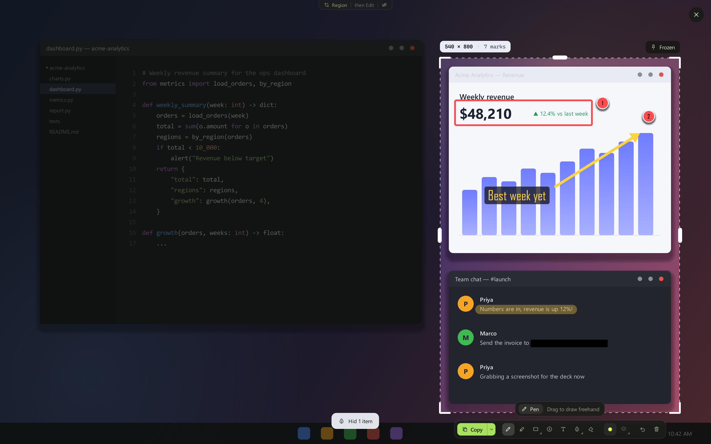
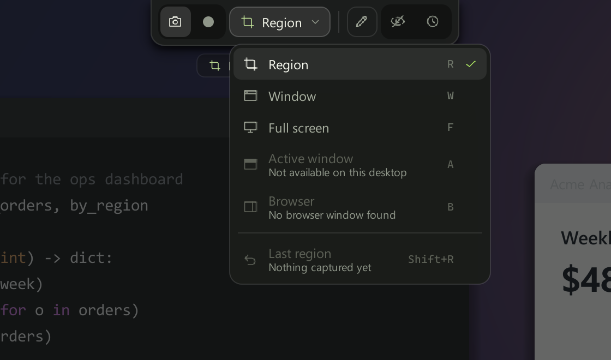
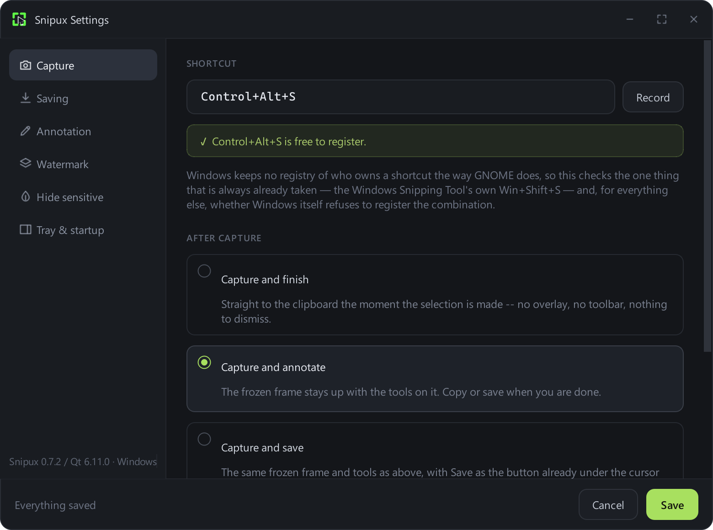
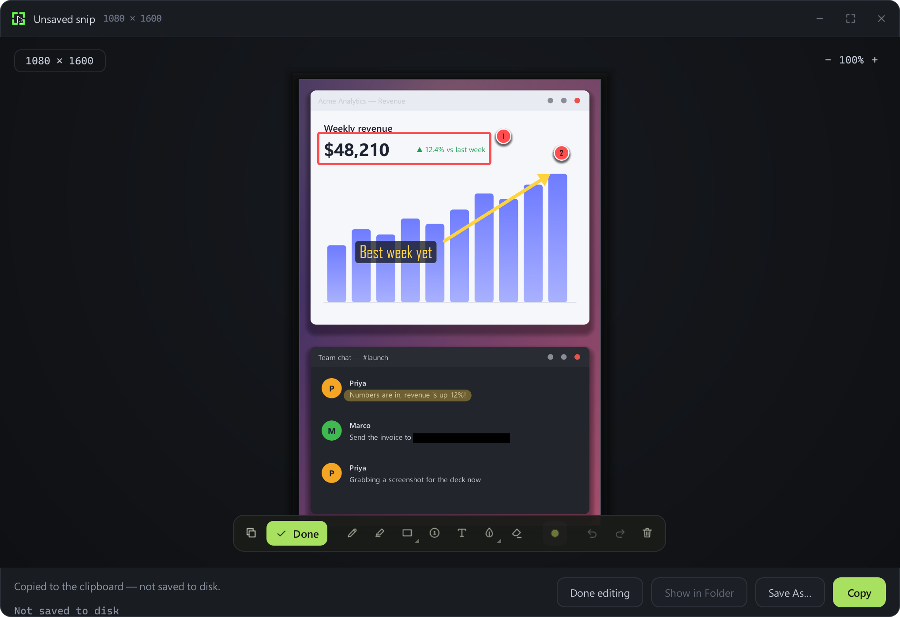
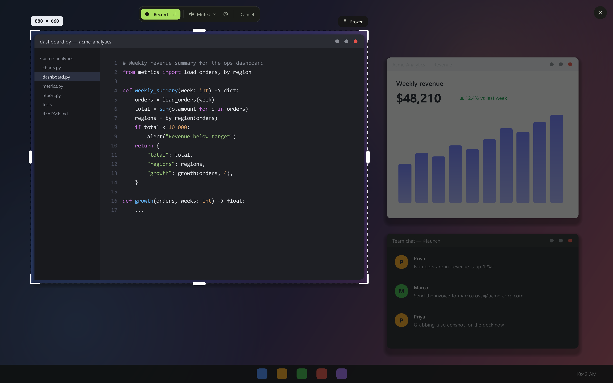
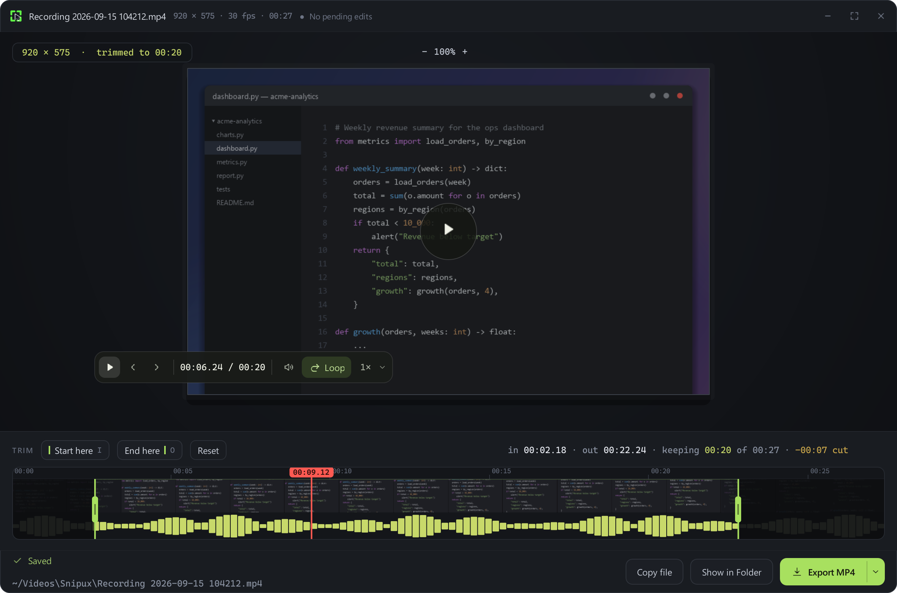

<h1 align="center">Snipux</h1>

<p align="center">
  <strong>Snip, annotate and record your screen — a Snipping Tool workalike for Linux and Windows.</strong>
</p>

<p align="center">
  <a href="https://github.com/CydoEntis/snipux/actions/workflows/ci.yml"></a>
  <a href="https://pypi.org/project/snipux/"></a>
  <a href="https://pypi.org/project/snipux/"></a>
  
  <a href="LICENSE"></a>
</p>

<p align="center">
  <a href="#install">Install</a> ·
  <a href="#using-snipux">Using Snipux</a> ·
  <a href="#recording">Recording</a> ·
  <a href="#the-player">The player</a> ·
  <a href="#tools-and-shortcuts">Shortcuts</a> ·
  <a href="CHANGELOG.md">Changelog</a>
</p>

<p align="center">
  
</p>

Snip an area, a window, or the whole screen. Draw on it, blur out the parts
that shouldn't be shared, and copy or save it. Or record the same
region to a video file and trim it down. The workflow Windows gives you for
free, on Linux too — and a slightly better one back on Windows.

## Features

- **Snip anything** — a region, a window, the whole monitor, the window you were
  just using, just your browser's page, or the same rectangle as last time.
- **Annotate in place** — pen, highlighter, arrows, boxes, numbered steps, text
  and blur, drawn straight onto the frozen screen. No separate editor to open.
- **Hide sensitive** — one switch blacks out passwords, API keys, card numbers
  and email addresses before the snip leaves your screen *(Windows)*.
- **Record the same selection** — to MP4 on Windows or WebM on GNOME, with an
  optional countdown.
- **Trim and export** — a player with a filmstrip and waveform, exporting MP4,
  WebM, GIF or a single frame.
- **Watermark** — stamp text or an image in a corner of every capture.
- **Keep the pointer out of a recording** — or in it, decided on the same row
  you pick the region on *(Linux; Windows' recorder has no cursor option)*.
- **One shortcut** — Ctrl+Alt+S, on both platforms.

MIT licensed. Install it with `winget install snipux`, a `.deb`, an
AppImage, or `pip install snipux` — see [Install](#install). What changed in
each release is in [CHANGELOG.md](CHANGELOG.md).

## Platform support

| Platform | State | How it captures |
|----------|-------|-----------------|
| **Linux** (Ubuntu 22.04+ GNOME; Arch/Omarchy Hyprland) | Supported | Wayland via `grim`/the screenshot portal; recording via GNOME Shell or `gpu-screen-recorder`. X11 captures directly. |
| **Windows** (10 2004+ / 11) | Supported | Qt's `QScreenCapture`, plus Win32 for the hotkey and shortcuts. |
| **macOS** | Not yet | The platform seam exists; nothing behind it is implemented. Every operation raises `UnimplementedPlatformError`. |

Linux is tested against Ubuntu/GNOME and Arch/Omarchy/Hyprland. Other desktops
can use the same Wayland capture tools; recording needs either GNOME Shell or
`gpu-screen-recorder` (see [Recording](#recording)).

## Why

Linux has capable screenshot tools, but the Ubuntu/GNOME/Wayland combination is
where most of them get awkward — Wayland deliberately forbids applications from
reading the screen whenever they like, so every capture has to go through a
permission broker, and the tools that predate that constraint fight it. Snipux
treats it as the primary target rather than an afterthought.

## How it works

Capture the entire virtual desktop in a single shot, then run selection against
that frozen frame in our own overlay. The compositor is involved for exactly one
instant, which is what lets the same code path behave identically on X11 and
Wayland — and what made the Windows port a backend swap rather than a rewrite.
Everything downstream — region select, annotation, export — is ordinary drawing
on an image already held in memory.

Recording rides the same rule: **the frozen frame is still how you choose, and
recording starts once you have chosen.** The compositor is never involved while
you are dragging.

## Install

### Linux

**A file to download, if you would rather not install Python at all.** Both
artifacts on the
[latest release](https://github.com/CydoEntis/snipux/releases/latest) carry
their own Python and Qt:

```sh
# Ubuntu, Debian, Mint -- anything with apt
sudo apt install ./snipux_1.1.2_amd64.deb

# or, on any distribution, with no root and no install step at all
chmod +x Snipux-1.1.2-x86_64.AppImage
./Snipux-1.1.2-x86_64.AppImage
```

On Arch, Omarchy and other Arch-based systems, install FUSE 2 before running
the AppImage:

```sh
sudo pacman -S fuse2
```

Either way the first launch writes the same three things `--setup` does —
the desktop entry, the autostart entry and the Ctrl+Alt+S shortcut — so
there is no second command to run. Two things worth knowing:

- **Keep the AppImage somewhere it will stay.** The shortcut points at the
  file itself, so if you move it later, run it once from its new home to
  re-point the shortcut.
- **Updating is downloading the newer file**, not `snipux --update`: the
  `.deb` installs over the old one, and the AppImage replaces it.
- **Uninstalling the `.deb` wants `snipux --remove` first.** `apt remove`
  clears what the package installed, but the desktop entry, autostart entry,
  icons and Ctrl+Alt+S shortcut that the first launch wrote live in your own
  home directory, where no package can reach them.

The rest of this section installs Snipux as a Python package instead, which
is what `snipux --update` upgrades in place.

First, the things Ubuntu may not already have — [pipx](https://pipx.pypa.io/)
and one library Qt needs that nothing else on a stock desktop pulls in:

**One line, if you would rather not read the rest of this section:**

```sh
curl -fsSL https://raw.githubusercontent.com/CydoEntis/snipux/main/packaging/install.sh | bash
```

That checks the two prerequisites below by name, installs Snipux into an
environment of its own, runs `--setup` and starts it. The rest of this
section is the same thing by hand.

```sh
sudo apt install pipx libxcb-cursor0
pipx ensurepath      # only needed once, and only if pipx was just installed
```

On Arch/Omarchy the equivalent prerequisites, plus the native Hyprland capture
and recording tools, are:

```sh
sudo pacman -S python-pipx xcb-util-cursor grim slurp gpu-screen-recorder
pipx ensurepath
```

`libxcb-cursor0` is not optional: without it Snipux installs cleanly and then
crashes on launch, behind four lines of Qt plugin text that name the library
but not the package. Then:

```sh
pipx install snipux
snipux --setup
snipux &
```

**pipx, not `pip`, on Linux.** On Ubuntu 23.04 and newer (and Debian 12+) a
system-wide `pip install` is refused outright — "externally-managed-
environment" — because that Python belongs to apt. On 22.04 pip does not
refuse, which is worse rather than better: it installs into `~/.local`,
where a later `apt upgrade` of PyQt6 can leave two versions disagreeing
about which one is loaded. pipx gives Snipux and its dependencies an
environment of their own and puts a `snipux` launcher on `PATH`. `--setup`
writes the pieces pipx can't — the `.desktop` entry, the autostart entry, and
the GNOME or Hyprland shortcut — and is safe to re-run. On Omarchy it adds a
delimited block to `~/.config/hypr/bindings.lua`; classic Hyprland uses
`hyprland.conf`. Existing bindings are left alone and `--remove` removes only
Snipux's marked block.

**The third line is not optional the first time.** The shortcut runs
`snipux --snip`, which needs a resident Snipux to talk to, and `--setup` only
*writes* the autostart entry — it doesn't start anything. Without it the key
you just bound does nothing until your next login. (`packaging/install.sh`
does this step for you, which is why it isn't mentioned there.)

That's it — press **Ctrl+Alt+S**.

Contributing rather than just using it? Install the repository itself, so
`pipx upgrade` refetches the branch rather than the last release:

```sh
pipx install git+ssh://git@github.com/CydoEntis/snipux.git
```

**From a clone instead.** `packaging/install.sh` does the same job without
pipx — it builds a virtual environment under `~/.local/share/snipux/venv`,
installs into it, drops a launcher in `~/.local/bin`, runs `--setup`, and
starts the app. It checks for the `python3-venv` and `libxcb-cursor0`
prerequisites first and names the package to install if either is missing:

```sh
git clone https://github.com/CydoEntis/snipux.git
cd snipux
./packaging/install.sh
```

### Windows

**One line, in PowerShell:**

```powershell
irm https://raw.githubusercontent.com/CydoEntis/snipux/main/packaging/install.ps1 | iex
```

That finds a Python 3.10+, installs one with winget if there is none,
installs Snipux from PyPI, writes the Start Menu and Startup entries and the
Ctrl+Alt+S shortcut, and starts it. Re-running it upgrades an existing
install. Nothing needs administrator rights.

**Or by hand.** The one prerequisite is
**[Python 3.10+](https://www.python.org/downloads/)** — tick *"Add python.exe
to PATH"* in the installer. Nothing else: no Git, no pipx, no file to
download by hand. Then, in PowerShell:

```powershell
py -m pip install snipux
py -m snipux
```

The first line takes a few minutes because it pulls down Qt. The second
starts Snipux.

**The first launch sets itself up**: a Start Menu shortcut, a Startup entry so
it is running after every login, and the **Ctrl+Alt+S** shortcut. After that,
Ctrl+Alt+S is all anyone needs — no terminal again.

`snipux --setup` does the same thing explicitly, but is not a step to hand
anyone: it is for redoing the integration after a move.
`AppController.run_first_launch_setup` already runs it the first time the app
is ever the resident instance.

**Snipux has to actually be running for the hotkey to do anything.** Unlike
GNOME's shortcut on Linux, which the desktop itself owns, Windows' hotkey is a
registration the Snipux process holds only while it's alive. That's what
autostart is for: the Startup entry means Snipux is already running by the time
you'd want to press the shortcut, from the next login onward. The first time,
start it yourself with the second command above.

**Nothing in the pip route trips Smart App Control or SmartScreen**, which
is part of why it exists. Both react to unrecognised *executables*; this is
Python source installed by the `python.exe` the user already trusts. The two
downloads below are executables, and both are unsigned — see
[what that means](#a-word-on-the-warnings).

### Or download it

Neither needs Python.

```powershell
winget install snipux
```

Or from the [latest release](https://github.com/CydoEntis/snipux/releases/latest):

- **`snipux-setup-<version>.exe`** — the installer. Installs per-user (no
  admin prompt), appears in Add/Remove Programs, and starts Snipux when it
  finishes. This is what `winget install` runs.
- **`snipux.exe`** — the same app as a single portable file. No installer,
  no Add/Remove entry: run it and it sets itself up, moving itself somewhere
  stable first so a tidy-up of Downloads doesn't break it.

### A word on the warnings

Both downloads are unsigned, deliberately: a certificate Windows trusts
costs a few hundred a year plus a hardware token, which is not a trade worth
making for a tool this size.

What that means in practice:

- **SmartScreen** shows "Windows protected your PC" on first run. *More
  info → Run anyway* gets past it. Most people see this one.
- **Smart App Control**, on some Windows 11 machines, blocks the *installer*
  outright — no "Run anyway", and the message reads as though the file is
  corrupt. It does not block the portable exe, which is why both are
  published: if the installer refuses to run, download `snipux.exe` instead
  and it will work.

Full reasoning in
[docs/releasing.md](docs/releasing.md#why-the-installer-is-shipped-unsigned-alongside-the-portable-exe).

### Updating

```powershell
snipux --update
```

If that answers `'snipux' is not recognized`, use:

```powershell
py -m snipux --update
```

Then quit Snipux from the tray and press Ctrl+Alt+S to start the new one.

**Why two.** Neither form works everywhere, because it depends on how Snipux
was installed, and the same machine cannot tell you which:

| Installed with | `snipux --update` | `py -m snipux --update` |
|---|---|---|
| `py -m pip install …` (this README) | only if Python's `Scripts` folder is on `PATH` | ✅ |
| `pipx install snipux` (Linux) | ✅ | ❌ `No module named snipux` |

`pipx` puts Snipux in an environment of its own and a launcher on `PATH`, so
the bare command works and `py -m` cannot see it at all — `py` runs the
*system* Python, which has no Snipux in it. A plain `pip install` is the other
way round. Try the bare command first, since it is shorter and covers the
older instructions people may already have followed.

**Installed with pipx? There is nothing to undo.** `pipx upgrade` is the
cleanest route for those installs, and needs no reinstalling and no
uninstalling first:

```sh
pipx upgrade snipux
```

**Installed from a GitHub URL, before Snipux was on PyPI?** Also nothing to
undo. It is the same package under the same name, so upgrading replaces it in
place — pip uninstalls the old copy itself:

```powershell
py -m pip install --upgrade snipux
```

An install made from `git+https://github.com/CydoEntis/snipux.git` is the one
exception: pipx recorded that URL and keeps tracking the branch, so it
upgrades to the tip of `main` rather than to the newest release. That is
usually what someone who installed that way wanted. There is no reason to
switch a working pipx install over to `pip`, and doing so without uninstalling
first leaves two copies fighting over one Ctrl+Alt+S registration and two
Startup entries.

Either way `--update` runs exactly this on their behalf — it is not a second
update mechanism, just the same one without a command to keep somewhere
findable:

```powershell
py -m pip install --upgrade snipux
```

Nothing else to run: the shortcut and hotkey point at a location that does not
change between versions.

**Check it worked:** tray → Settings, bottom-left, e.g.
`Snipux 1.0.2 / Qt 6.11.0 · Windows`.

> `--upgrade` compares versions, so **every release needs a new version
> number** in `pyproject.toml`. Left the same, pip decides the requirement is
> already satisfied and changes nothing — no error — so a fixed build
> published under an old number is a silent no-op and the bug gets reported a
> second time. `.github/workflows/release.yml` refuses to publish a tag whose
> number disagrees with `pyproject.toml`, which is the half of this a person
> can get wrong. (`--force-reinstall` overrides the comparison, but it also
> re-downloads Qt, so it is not what to tell people.)

**Snipux checks once a day and offers one click.** The first time you open it
on a new day it asks GitHub whether there is a newer release. If there is, the
tray says so and its menu item becomes **Update to 1.2.0** — which downloads
the new installer, runs it, and starts Snipux again.

Nothing installs itself. The check can only put a sentence in the tray; every
update is a click.

Where that one click is not possible, it tells you what is: `snipux --update`
for a pip install, and the Releases page for a `.deb` (installing a package
needs root, which a tray app should not be asking for).

Those are the only times Snipux touches the network, and nothing is sent but
the request: no token, no identifiers, nothing about the machine.

### Installing a specific version, or offline

Any published version installs by name:

```powershell
py -m pip install snipux==0.5.0
```

An unreleased commit still installs from this repository directly:

```powershell
py -m pip install https://github.com/CydoEntis/snipux/archive/refs/heads/main.tar.gz
```

For a machine with no network, or to pin exactly what someone runs, build a
wheel and hand them the file instead:

```powershell
python -m build --wheel
```

That writes `dist/snipux-<version>-py3-none-any.whl`, which installs the same
way — `py -m pip install snipux-1.0.2-py3-none-any.whl`. Every release
also carries its wheel and sdist on
[its GitHub release page](https://github.com/CydoEntis/snipux/releases), so
there is nothing to build for this.

### The shortcut

The default is **Ctrl+Alt+S** on both platforms.

Not Win+Shift+S, the combination the Windows Snipping Tool uses: Windows won't
hand that to a second application — `RegisterHotKey` refuses it — so Snipux
would have needed a different key on Windows regardless. One combination on both
platforms beats two. See
[docs/gnome-shortcut.md](docs/gnome-shortcut.md#why-controlalts-and-not-supershifts).

#### Using a different shortcut

```sh
snipux --setup --shortcut 'Super+Shift+X'
```

Either spelling is accepted — the readable `Super+Shift+X` or gsettings'
`<Super><Shift>x` — since both normalise to the same thing. `'Print'` and
`'F9'` work too. Anything that isn't a shortcut is rejected with an explanation
rather than bound and silently ignored.

The choice is remembered in `~/.config/snipux/config.json`, so later `--setup`
runs — including the one `packaging/install.sh` performs on every install —
keep it instead of reverting to the default. `snipux --remove` deletes it along
with everything else `--setup` wrote.

Or set it from **tray → Settings…**, which records the combination you press
rather than making you spell out any syntax, and warns you if GNOME already uses
it. That warning only sees GNOME's own shortcuts — an application that grabs a
key directly owns it just as effectively and can't be detected, so "No GNOME
shortcut uses this" is not a promise the key is free.

No tray icon? `snipux --settings` opens the same window.

## Using Snipux

Snipux runs resident in the background (with a tray icon, where one is
available) so the shortcut reaches an already-warm process instead of paying
startup cost on every snip.

1. **Press Ctrl+Alt+S.** The whole virtual desktop freezes into a full-screen
   overlay. This single frozen frame is what selection and annotation both work
   against, which is why the flow is identical on Wayland and X11.
2. **Choose what to capture, and what happens to it.** A row docked at the top
   of the screen carries both: a capture mode, and a destination.
3. **Drag.** Or, in Window mode, hover — the window under the cursor is
   outlined and named — and click to accept it.
4. **Annotate in place**, directly on the frozen desktop; there's no separate
   editor window. You can keep reframing as you go: drag any edge or corner of
   the selection and the ink you've already drawn stays exactly where it was
   drawn, over the same pixels, instead of moving with the selection or getting
   clipped away.
5. **Copy or save** from the bar that appears under the selection.

<p align="center">
  
</p>

### Capture modes

| Mode | What it captures |
|------|------------------|
| **Region** | Any rectangle you drag |
| **Window** | One application's window |
| **Full screen** | The whole monitor you are on — not every monitor |

### What happens after a snip

Set per-capture from the chooser row, or as a default in Settings:

| Destination | What it does |
|-------------|--------------|
| **Capture and finish** | Straight to the clipboard the moment the selection is made — no overlay, no toolbar, nothing to dismiss |
| **Capture and annotate** | The frozen frame stays up with the tools on it. Copy or save when you're done. *(default)* |
| **Capture and save** | The same frozen frame and tools, with Save as the button already under the cursor instead of Copy |
| **Capture and review** | Opens the review window afterwards, which annotates too |

<p align="center">
  
</p>

### The review window

Copy and Save both dismiss the overlay immediately, so a snip saved to the wrong
place — or copied when you meant to save — means taking the capture again. The
review window is the answer: the image, where it went, and Copy / Save As… /
Show in Folder.

<p align="center">
  
</p>

Press **Edit** and it reveals the overlay's *own* floating bar over the
image — the same widget, the same tools, the same mark model, so there is no
second tool set to drift. The only differences are that there's no capture-mode
chip (nothing left to capture) and the bar's trailing action is `Done`, since
the footer already owns Copy and Save As.

Marks made here live in image coordinates rather than screen coordinates, so
they survive zooming and export exactly where they looked. Several snips in a
row leave several windows open.

## Recording

Switch the chooser row from snipping to recording and the same selection you'd
have screenshotted becomes the thing that gets filmed. Region, Window and Full
screen all record.

Committing a selection **arms** a recording rather than starting one, so you can
still reframe it with the handles. One pill carries the whole thing and its
button always names what a click does — **Record**, then "Starting in 3"
during a delay, then the running clock and **Stop** — sitting top-centre of the
monitor being recorded, moving out of the way only when the recording covers
that strip. An optional 3s / 5s / 10s delay shows as a countdown numeral inside
the region.

<p align="center">
  
</p>

Window mode films **where the window is right now**. It does not follow a window
that moves mid-recording; there's no window-following in the API to build it on.

**What you get, per platform:**

| | Linux (GNOME) | Linux (Hyprland/wlroots) | Windows |
|---|---|---|---|
| Backend | GNOME Shell D-Bus | `gpu-screen-recorder` | Qt `QScreenCapture` |
| Container | WebM — GNOME Shell picks it | MP4 | MP4 |
| Audio | System sound or mic with system `ffmpeg` | System sound or mic directly | Mic |
| Pause | Yes, with system `ffmpeg` to join pieces | Not yet | Yes |
| Frame rate | Up to 30fps | Configured frame rate | ~30fps ceiling |

On GNOME the route is `org.gnome.Shell.Screencast`; on Hyprland and other
wlroots compositors it is `gpu-screen-recorder`, using the exact region chosen
on Snipux's frozen frame and SIGINT on Stop so the video is finalized. Run
`snipux --list-backends` to see which route is available and an install command
when an optional recorder is missing.

### Where a recording goes

Set the same way as a snip's destination:

| Destination | What it does |
|-------------|--------------|
| **Copy to the clipboard** | The video goes to the clipboard as a file reference and the file is deleted. Paste it somewhere that accepts a file. *(default)* |
| **Save to a folder** | Moved into your recordings folder |
| **Open in the player** | Saved as above, then opened in the trim editor |

## The player

The `Open` destination's other half: playback, a rail with a decoded filmstrip
and a real waveform, in/out handles with a plain-language readout, and export.

<p align="center">
  
</p>

| Key | What it does |
|-----|--------------|
| `Space` | Play / pause |
| `I` | Set the start at the playhead |
| `O` | Set the end at the playhead |
| `←` / `→` | Previous / next frame |
| `M` | Mute — drops the audio track on export |
| `L` | Loop the trimmed range |
| `Esc` | Close an open menu |

**Export formats:**

| Format | Notes |
|--------|-------|
| **WebM** | What was recorded — no re-encode when untrimmed |
| **MP4 (H.264)** | Plays anywhere. Slack, Teams, browsers. *(default)* |
| **GIF** | Silent, loops. Big above ~10 seconds. |
| **Current frame as PNG** | Just the frame under the playhead |

Trimming re-encodes; the untrimmed original stays at its own path until you
overwrite it.

### About ffmpeg

Snipux does not depend on `ffmpeg`, does not bundle it, and never installs it.
But if one is already on your `PATH`, the player uses it — because Qt's bundled
FFmpeg is an LGPL build with no software x264, so it cannot encode H.264 in
software at all.

**With a system ffmpeg**, all four export formats work. **Without one**, MP4
degrades to MPEG-4 Part 2 and the row says so, while GIF and trimmed WebM grey
out with their reason. Every export still works, one codec down. Nothing is
hidden from you either way.

## Tools and shortcuts

| Key | Tool | What it does |
|-----|------|--------------|
| `P` | Pen | Drag to draw freehand |
| `H` | Highlighter | Sweep over the text that matters and it snaps to the lines, one band per line. Its style button switches it to freehand |
| `A` | Arrow | Drag from tail to head |
| `R` | Rectangle | Drag to box something in. Its button also holds Ellipse (`O`) and Straight line (`L`): click it again once it is picked to open that menu |
| `S` | Step | Click to drop the next numbered marker |
| `T` | Text | Click, then type into the label |
| `B` | Blur | Drag over anything private to obscure it |
| `E` | Eraser | Click a mark to remove it |
| `Ctrl+Z` / `Ctrl+Shift+Z` | — | Undo / redo |
| `Enter` | — | Copy the annotated snip to the clipboard and close the overlay |
| `Esc` | — | First press discards all ink and leaves the overlay open; press again (once there's nothing left to discard) to close without capturing |
| `?` | — | Toggle the on-screen shortcut hint bar |

Colour and stroke width are chosen from the tray that appears once a drawing
tool is selected — the eraser has none. Tool shortcuts and `Enter` are
suppressed while a text label or a slider has keyboard focus; `Esc` and
undo/redo always work regardless.

## Where files go

| | Folder | Default filename |
|---|---|---|
| Snips | `~/Pictures/snipux` | `Screenshot from YYYY-MM-DD HH-MM-SS.png` |
| Recordings | `~/Videos/snipux` | `Recording from YYYY-MM-DD HH-MM-SS.webm` |

Both directories are created if they don't exist yet, and a toast confirms the
path each time. The folder and filename pattern are both configurable in
Settings.

If Snipux runs into an error it did not expect, it keeps running and writes the
details to `~/.config/snipux/crash.log`, beside its settings.

## Command reference

| Command | What it does |
|---------|--------------|
| `snipux` | Start the resident/tray instance (or forward a snip request to one already running) |
| `snipuxw` | The same, with no console window. On Windows this is what the Start Menu and Startup entries run, and what a bare `snipux` starts before giving the terminal back — so closing the terminal does not close Snipux |
| `snipux --snip` | Ask the running instance to start a capture, starting one first if needed. This is what the shortcut runs |
| `snipux --settings` | Open Settings — the way in on a machine with no tray icon |
| `snipux --setup` | Install desktop integration. Safe to re-run |
| `snipux --setup --shortcut '…'` | Same, binding a specific accelerator and remembering it |
| `snipux --remove` | Undo everything `--setup` wrote |
| `snipux --update` | Fetch and install the newest Snipux from PyPI, then say what to restart. `py -m snipux --update` is the same thing where `PATH` has no `snipux` on it |
| `snipux --list-backends` | Print every capture *and* recording backend, its availability, and why the unavailable ones aren't |

## Uninstall

Run `snipux --remove` **first**, so the desktop entry, the autostart entry,
the installed icons and the bound shortcut all go with it. Then remove the
package the way it was installed.

Installed with pipx:

```sh
snipux --remove
pipx uninstall snipux
```

Installed with pip:

```powershell
py -m snipux --remove
py -m pip uninstall snipux
```

If you are unsure which you have, `pipx list` and `py -m pip show snipux`
answer it — and if both do, you have two copies, which is worth fixing:
they fight over one Ctrl+Alt+S registration, and whichever loses simply
never answers the shortcut. Remove one of them.

Uninstalling only removes the installed package — it has no idea `--setup`
also wrote files outside it, so skipping `--remove` first leaves an autostart
entry pointing at a binary that no longer exists, a dead keyboard shortcut, and
a ghost entry in your application list. `--remove` only ever splices its own
custom-keybinding slot out of GNOME's list, so any other shortcuts you've set up
by hand are left alone. Safe to re-run, same as `--setup`.

On Windows, `snipux --remove` also removes the copy of itself it relocated into
`%LocalAppData%\snipux` on first run.

## Troubleshooting

**No tray icon.** Stock Ubuntu/GNOME ships no legacy tray icon support at all
unless the
[AppIndicator and KStatusNotifierItem Support](https://extensions.gnome.org/extension/615/appindicator-support/)
GNOME Shell extension is installed and enabled. Without it, Snipux still runs
and still answers the shortcut — it just prints a notice to stdout on startup
and has no tray icon or Quit menu item. Use `snipux --settings` to reach
Settings, and kill the process to quit. Install the extension if you want the
icon and menu back.

**Capture fails, or a permission prompt appears every time.** On Wayland,
capture goes through `xdg-desktop-portal`, which owns the permission prompt
itself. If a capture reports the request was cancelled, press the shortcut again
and approve the prompt when it appears. If it instead reports the request failed
outright, check that `xdg-desktop-portal` and a desktop-appropriate portal
backend (e.g. `xdg-desktop-portal-gnome`) are installed and running — Snipux
can't get pixels if the portal that owns them refuses, or isn't there at all.

**Recording is unavailable.** `snipux --list-backends` answers this directly:
capture and recording are separate registries with separate answers. On Linux,
recording needs GNOME Shell — see [Recording](#recording).

**`No module named snipux` when updating.** `py` runs the *system* Python,
and Snipux is not installed in it — which is normal if it was installed with
`pipx`, whose whole job is to keep it in an environment of its own. Use the
bare command instead:

```powershell
snipux --update
```

If neither that nor `py -m snipux --update` works, nothing is installed where
either can see it. `pipx list` says whether pipx has it; `py -m pip show
snipux` says whether the system Python does. Install per
[Windows](#windows) above and both will work.

**`'snipux' is not recognized`.** The opposite case: it is installed in the
system Python, but that Python's `Scripts` folder is not on `PATH`. Use
`py -m snipux --update`, which does not need `PATH` at all. (Re-running the
Python installer and ticking *"Add python.exe to PATH"* fixes it properly.)

**Nothing happens when I press the shortcut.** Check `snipux --snip` works when
run by hand from a terminal. On Windows, check Snipux is actually running: the
hotkey is a registration the process holds, and Windows releases it the moment
the process exits.

**Something stopped working partway through a snip.** Look in
`~/.config/snipux/crash.log` (on Windows, `%USERPROFILE%\.config\snipux\crash.log`).
Each unexpected error is written there once, with the version it happened in —
attach that file when you report the problem.

## What hasn't been tested yet

Development has happened on Windows and in an Ubuntu VM. These are believed to
work from the design but haven't been verified on real hardware:

- Fractional display scaling on a real machine at 1.25× — the test suite is kept
  green at 1.0× and 1.5×
- X11 sessions end to end — the D-Bus recording route works, but the overlay and
  capture path under a real X11 session remain less exercised than Wayland
- Pasting into a file manager or chat app — the clipboard mime data is verified
  correct on the wire, but nobody has watched a paste land
- macOS, entirely

If one of these is where something goes wrong, that's a known gap, not a
mystery.

## Requirements

- **Python 3.10+** (not needed for the Windows `.exe`)
- **PyQt6 6.8+** and **jeepney** — installed automatically
- **`libxcb-cursor0`** on Linux (`sudo apt install libxcb-cursor0`). Qt 6.5+
  needs it to load its xcb platform plugin, and nothing else on a stock Ubuntu
  desktop pulls it in. Without it Snipux installs cleanly and then crashes on
  launch; `packaging/install.sh` checks for it before doing anything.
- **`python3-venv`** on Debian/Ubuntu if you use `packaging/install.sh`
- **Ubuntu 22.04+** (Wayland or X11), **Arch/Omarchy with Hyprland**, or
  **Windows 10 2004+ / 11**
- **`ffmpeg`** — genuinely optional, never installed. See
  [About ffmpeg](#about-ffmpeg).

## Development

```sh
python -m venv .venv
source .venv/bin/activate
pip install -r requirements.txt

QT_QPA_PLATFORM=offscreen python -m pytest -q     # the verify step
python -m snipux                                  # run it
```

Tests must pass headless — a build machine has no display. `QWidget.grab()`
runs a full `paintEvent` into an offscreen pixmap without showing anything, and
that's the preferred way to test painting code.

[CLAUDE.md](CLAUDE.md) is the working guide to the codebase: the one
architectural rule, the module layout, and the conventions. `docs/design/`
holds the locked design handoffs, each with a `divergences.md` recording what
was built differently and why — read those before "fixing" anything back to a
handoff.

## Contributing

Issues and pull requests are welcome. Please read
[CONTRIBUTING.md](CONTRIBUTING.md) first — it's short, and it covers the two
things that matter most here: the architectural rule that isn't negotiable, and
why a green test suite is weaker evidence in this codebase than you'd expect.

## Licence

MIT — see [LICENSE](LICENSE).
